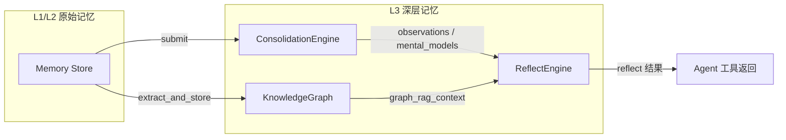
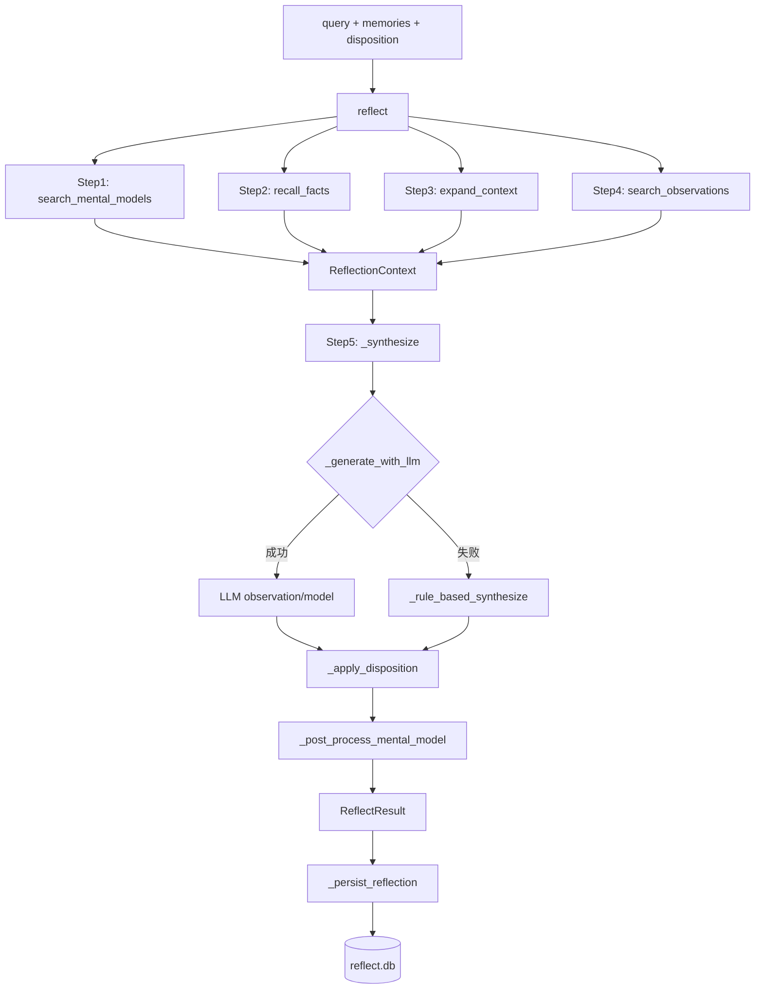
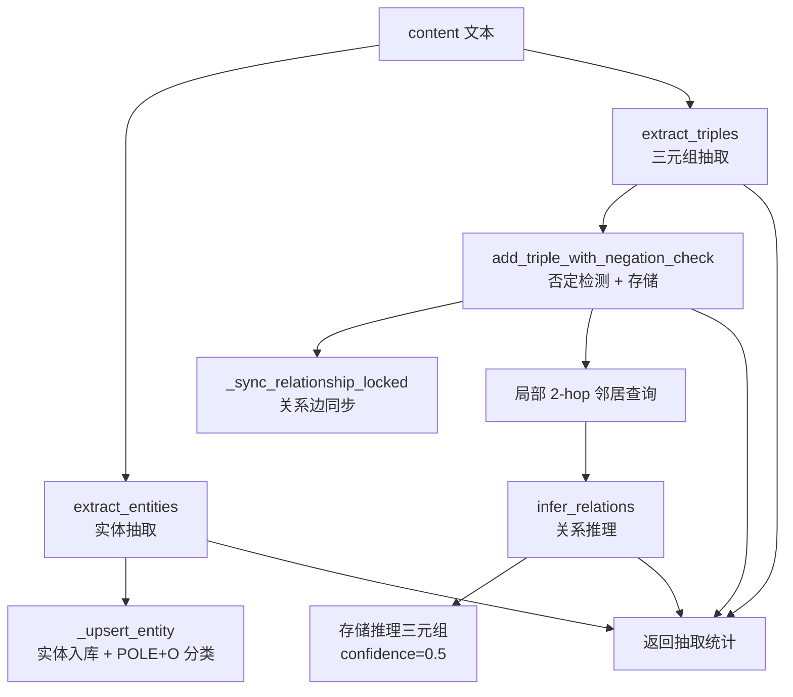
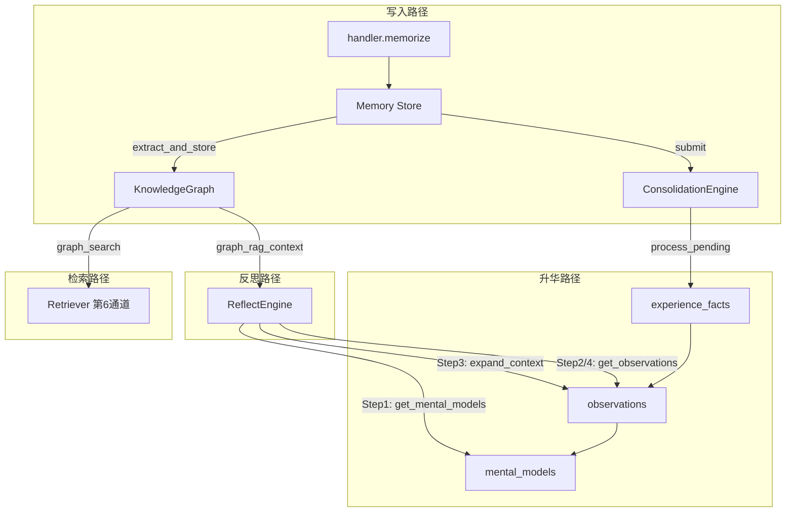

# L3 深层记忆架构说明

## 概述

L3 深层记忆层负责反思、知识升华与图谱构建，是 OmniMem 五层认知架构的核心反思层。它将零散的原始事实（L1/L2 写入的记忆）通过自动升华管线转化为结构化的观察与抽象心智模型，同时构建可推理、可查询的时序知识图谱，为上层 Agent 提供跨记忆的归纳推理能力。

L3 由三个核心引擎组成：

| 引擎 | 职责 | 主入口 |
| --- | --- | --- |
| `ConsolidationEngine` | 事实→经验→观察→心智模型的四阶段自动升华 | `deep/consolidation.py` |
| `ReflectEngine` | 受查询触发的四步反思循环 + Disposition 性格修饰 | `deep/reflect/pipeline.py` |
| `KnowledgeGraph` | SQLite 时序知识图谱：三元组抽取、关系推理、Graph RAG | `deep/kg/builder.py` |

三者通过"事实/观察/心智模型"三级数据契约协作：`ConsolidationEngine` 产出观察与心智模型，`ReflectEngine` 消费这些产出做查询时反思，`KnowledgeGraph` 从原始记忆中抽取结构化关系作为补充检索通道。



---

## 1. ReflectEngine 反思引擎

### 1.1 模块组成

ReflectEngine 采用"主类 + 模块方法挂载"的设计模式：核心循环逻辑在 `pipeline.py` 的 `ReflectEngine` 类中，而 LLM 生成、规则归纳、持久化等能力通过模块方法挂载机制附加到类上，避免单文件膨胀。

| 文件 | 职责 |
| --- | --- |
| `deep/reflect/pipeline.py` | ReflectEngine 主类：四步反思循环主流程、初始化、SQLite 数据库管理 |
| `deep/reflect/disposition.py` | 数据模型：`Disposition` / `ReflectResult` / `ReflectionContext` 数据类 + 性格修饰函数 |
| `deep/reflect/prompts.py` | LLM 反思提示词构建、LLM 调用、输出解析（中文标记 / JSON） |
| `deep/reflect/synthesis.py` | 规则归纳回退：智能关键词提取、短语提取、关键词堆砌检测与修复 |
| `deep/reflect/writer.py` | 反思结果持久化到 SQLite `reflections` 表 |

模块挂载机制见 `pipeline.py:392-409`：

```python
# 挂载 prompts / synthesis / writer 模块方法到 ReflectEngine
ReflectEngine._generate_with_llm = _prompts_module._generate_with_llm
ReflectEngine._parse_llm_output = _prompts_module._parse_llm_output
ReflectEngine._smart_extract_keywords = _synthesis_module._smart_extract_keywords
# ... 其他方法同理
ReflectEngine._persist_reflection = _writer_module._persist_reflection
```

### 1.2 四步反思循环

ReflectEngine 的反思循环（Hindsight-inspired）在 `pipeline.py:121-162` 的 `reflect()` 方法中编排，包含五步（注释中称四步循环，第五步为综合生成）：

| 步骤 | 方法 | 位置 | 输入 | 输出 |
| --- | --- | --- | --- | --- |
| Step 1 | `_search_mental_models` | `pipeline.py:224-228` | `query: str` | 已有心智模型列表（来自 ConsolidationEngine，limit=5） |
| Step 2 | `_recall_facts` | `pipeline.py:230-250` | `query`, 外部 `memories` | 相关事实列表（外部记忆 > recall_fn > Consolidation 观察，limit=20） |
| Step 3 | `_expand_context` | `pipeline.py:252-274` | `query`, `facts` | 扩展关联上下文（从事实提取关键词→查 Consolidation 观察，limit=15） |
| Step 4 | `_search_observations` | `pipeline.py:276-280` | `query: str` | 观察洞察列表（来自 ConsolidationEngine，limit=10） |
| Step 5 | `_synthesize` | `pipeline.py:284-376` | `query`, `ReflectionContext`, `Disposition` | `ReflectResult`（observation + mental_model + confidence） |

**Step 5 综合生成的核心逻辑**：

1. 收集所有内容片段（心智模型 / 观察 / 事实 / 扩展上下文），同时累积 `source_ids` 与 `depth`
2. 优先调用 LLM 推理归纳（`_generate_with_llm`，见 `prompts.py:20-161`），含最多 3 次重试、截断检测、关键词堆砌检测
3. LLM 不可用时回退到规则归纳（`_rule_based_synthesize`，见 `synthesis.py:224-258`）
4. 应用 Disposition 性格修饰（`_apply_disposition`，见 `disposition.py:69-128`）
5. 后处理：检测并修复关键词堆砌模式（`_post_process_mental_model`，见 `synthesis.py:424-479`）
6. 持久化到 SQLite（`_persist_reflection`，见 `writer.py:19-47`）

### 1.3 关键类与方法

#### `Disposition`（`disposition.py:14-42`）

反思性格参数，三维度控制输出语气：

| 维度 | 范围 | 默认 | 含义 |
| --- | --- | --- | --- |
| `skepticism` | 1-5 | 3 | 怀疑度，越高越审慎保守 |
| `literalness` | 1-5 | 2 | 字面度，越高越强调可验证性 |
| `empathy` | 1-5 | 4 | 共情度，越高越关注人的感受 |

方法：`clamp()`（范围约束）、`to_dict()`（序列化）。

#### `ReflectResult`（`disposition.py:45-55`）

反思结果数据类，字段：`observation` / `mental_model` / `confidence` / `sources` / `disposition_used` / `reflection_depth` / `query`。

#### `ReflectionContext`（`disposition.py:58-66`）

反思循环累积的上下文，字段：`query` / `mental_models` / `facts` / `observations` / `expanded`。

#### `ReflectEngine` 公开接口（`pipeline.py:31-220`）

| 方法 | 说明 |
| --- | --- |
| `__init__` | 初始化引擎，可选注入 consolidation_engine / recall_fn / llm_fn / llm_client |
| `reflect(query, memories, disposition)` | 执行完整反思循环，返回 `ReflectResult` |
| `get_reflection_history(query, limit)` | 查询历史反思记录（按时间倒序） |
| `get_stats()` | 获取反思统计（总次数 + 持久化数量） |
| `close()` | 关闭 SQLite 连接 |

### 1.4 数据流



**持久化结构**（`pipeline.py:99-113`，`reflections` 表）：

| 字段 | 类型 | 说明 |
| --- | --- | --- |
| `reflection_id` | TEXT PK | 反思 ID，格式 `ref-{count:04d}-{date}` |
| `query` | TEXT | 反思主题 |
| `observation` | TEXT | 观察结论 |
| `mental_model` | TEXT | 心智模型 |
| `confidence` | REAL | 置信度 0.0-1.0 |
| `disposition` | TEXT | 性格参数 JSON |
| `source_ids` | TEXT | 来源记忆 ID 列表 JSON |
| `created_at` | TEXT | UTC 时间戳 |

---

## 2. KnowledgeGraph 知识图谱

### 2.1 模块组成

KnowledgeGraph 同样采用"主类 + 模块方法挂载"模式。主类 `KnowledgeGraph` 在 `builder.py` 中，查询/时序/关系管理方法分别挂载自对应模块。

| 文件 | 职责 |
| --- | --- |
| `deep/kg/builder.py` | `KnowledgeGraph` 主类：DB 初始化、三元组增删、`extract_and_store` 自动抽取入口 |
| `deep/kg/entity.py` | 实体抽取与归一化：jieba + 规则正则 + 人名检测 + POLE+O 分类 |
| `deep/kg/extraction.py` | 三元组抽取：正则关系模式 + LLM 回退 + 关系推理（传递性/互逆） |
| `deep/kg/query.py` | 图查询：按主语/宾语/谓词查询、邻居扩展、最短路径、Graph RAG、社区发现 |
| `deep/kg/relationships.py` | 关系边同步：三元组→relationships 表、强度累计、批量回填 |
| `deep/kg/temporal.py` | 时序三元组：实体时间线、最近变更查询 |

方法挂载见 `builder.py:460-486`：

```python
KnowledgeGraph.query_by_subject = _query_module.query_by_subject
# ... 14 个 query 方法
KnowledgeGraph.get_timeline = _temporal_module.get_timeline
# ... 3 个 temporal 方法
KnowledgeGraph.get_stats = _relationships_module.get_stats
KnowledgeGraph._sync_relationship_locked = _relationships_module._sync_relationship_locked
KnowledgeGraph.sync_relationships_from_triples = _relationships_module.sync_relationships_from_triples
```

### 2.2 时序三元组结构

三元组存储在 `triples` 表（`builder.py:58-73`），支持时序有效性：

| 字段 | 类型 | 说明 |
| --- | --- | --- |
| `id` | INTEGER PK | 自增主键 |
| `subject` | TEXT | 主体实体 |
| `predicate` | TEXT | 谓词（关系类型，如 uses/causes/replaces） |
| `object` | TEXT | 客体实体 |
| `source_memory_id` | TEXT | 来源记忆 ID（推理产生的标记为 `inferred-from:{memory_id}`） |
| `confidence` | REAL | 置信度，默认 1.0；推理三元组为 0.5 |
| `is_negation` | INTEGER | 否定关系标记（0/1） |
| `valid_from` | TEXT | 有效起始时间 |
| `valid_to` | TEXT | 有效结束时间（空字符串或 NULL 表示仍有效） |
| `created_at` | TEXT | 创建时间戳 |

完整的时序三元组元组：(主体, 谓词, 客体, 来源记忆ID, 置信度, 是否否定, 有效起始, 有效结束, 创建时间)。

**冲突检测机制**（`builder.py:141-151`）：添加肯定关系时，若已存在对应的否定关系，则阻止添加并返回 -1。否定关系添加时（`add_triple_with_negation_check`，`builder.py:188-252`）会自动将已有肯定关系标记为失效（设置 `valid_to`）。

### 2.3 图谱构建流程

`extract_and_store`（`builder.py:299-376`）是从文本到图谱的核心入口，流程如下：



**实体抽取**（`entity.py:141-229`）采用多策略融合：

1. jieba NER + 词性标注（优先路径，含技术词典注册与 N-gram 合并）
2. 中文实体正则模式（组织/系统名、人名）
3. 英文实体模式（CamelCase、缩写、kebab-case、技术名词）
4. 通用关系模式（"使用/基于"前后的实体）
5. 裸中文人名检测（预编译姓氏正则 + 复姓支持）
6. 噪声过滤（停用词 + 低质量前缀/结尾过滤）

**实体分类**（`entity.py:243-308`）：POLE+O 五类分类法（参考 neo4j-labs/agent-memory）：
- **P**erson：人名（姓氏匹配 + 称谓后缀）
- **O**rganization：组织（公司/团队/部门等后缀）
- **L**ocation：地点（市/省/区等后缀，含已知地名优先匹配）
- **E**vent：事件（会议/发布/部署/测试等关键词）
- **O**bject：默认类型

**三元组抽取**（`extraction.py:119-169`）：优先使用 `TripleExtractor`（governance 模块），回退到内置正则 + LLM 逻辑。正则模式覆盖 14 种关系（`extraction.py:21-104`）：uses / belongs_to / causes / replaces / better_than / contains / located_in / requires / connects_to / part_of / used_for，以及否定关系 not_uses / differs_from。

**关系推理**（`extraction.py:222-258`）基于已有三元组推理隐含关系：
- 传递性：A uses B, B uses C → A uses C（适用 uses/causes/replaces）
- 互逆：A belongs_to B → B contains A

推理采用局部 2-hop 邻居查询（`builder.py:331-368`），避免全表扫描，推理产出的三元组 `confidence=0.5` 并标记 `source_memory_id=inferred-from:{memory_id}`。

### 2.4 查询与推理

KnowledgeGraph 提供丰富的图查询能力（`query.py`）：

| 查询类型 | 方法 | 说明 |
| --- | --- | --- |
| 基础查询 | `query_by_subject` / `query_by_object` / `query_by_predicate` | 按主语/宾语/谓词查询，大小写不敏感，带 TTL 缓存 |
| 邻居扩展 | `get_neighbors(entity, depth)` | 递归扩展邻居，支持多跳，带缓存 |
| 路径查找 | `find_path` / `shortest_path` | BFS 最短路径，支持回溯路径三元组 |
| 路径可视化 | `find_path_context` | 将路径格式化为可读推理链文本 |
| 图检索 | `graph_search` | 从查询提取实体→扩展搜索（第6检索通道） |
| Graph RAG | `graph_rag_context` / `graph_rag_search` | 生成实体子图的自然语言上下文，可注入 LLM |
| 社区发现 | `connected_components` | 基于连通分量的知识社区发现 |
| 实体图谱 | `get_entity_graph` | 按 POLE+O 类型分组的实体摘要 |

**TTL 查询缓存**（`builder.py:42-44, 280-295`）：`_cached` 方法为查询提供 30 秒 TTL 缓存，减少重复 SQLite IO。数据变更时通过 `_invalidate_cache()` 清除。

**置信度传播**：查询结果携带三元组的 `confidence` 字段，路径查找（`find_path_context`，`query.py:157-179`）会在输出中展示每跳的置信度，供下游推理参考。推理三元组置信度 0.5，原始抽取三元组默认 0.8（`extract_and_store` 调用时）或 1.0（直接 `add_triple`）。

**关系强度累计**（`relationships.py:39-68`）：`_sync_relationship_locked` 在每次添加三元组时同步到 `relationships` 表，已有关系的 `strength` 累加 0.1（上限 10.0），实现"多次出现的关系更强"的语义。

---

## 3. ConsolidationEngine 知识升华

### 3.1 升华流程

ConsolidationEngine（`deep/consolidation.py:180-538`）实现四阶段自动升华管线，参考 Hindsight 的仿生 Consolidation 设计：

| 阶段 | stage 名称 | 方法 | 说明 |
| --- | --- | --- | --- |
| Stage 1 | `world_facts` → `experience_facts` | `_annotate_experience`（`consolidation.py:381-407`） | 为原始事实添加上下文标注（纠错/偏好/技能/事实经验） |
| Stage 2 | `experience_facts` → `observations` | `_consolidate_observations`（`consolidation.py:409-438`） | 按主题聚类事实→LLM/规则生成观察 |
| Stage 3 | `observations` → `mental_models` | `_abstract_models`（`consolidation.py:440-463`） | 从观察抽象出心智模型（LLM/规则） |
| 持久化 | 各阶段产出 | `_persist_items`（`consolidation.py:465-489`） | 写入 SQLite `consolidation_items` 表 |

主流程在 `process_pending()`（`consolidation.py:239-274`）中编排：

```python
# Stage 1: world_facts → experience_facts
experience_facts = self._annotate_experience(facts)
# Stage 2: experience_facts → observations
observations = self._consolidate_observations(experience_facts)
# Stage 3: observations → mental_models
mental_models = self._abstract_models(observations)
# 持久化
self._persist_items(experience_facts, "experience_facts")
self._persist_items(observations, "observations")
self._persist_items(mental_models, "mental_models")
```

**LLM 优先策略**：Stage 2 和 Stage 3 都优先使用 LLM 生成（`_generate_observation_with_llm` / `_generate_model_with_llm`，`consolidation.py:346-379`），LLM 不可用时回退到规则归纳（`_generate_observation` / `_generate_mental_model`，`consolidation.py:147-174`）。

**主题聚类**（`_cluster_by_topic`，`consolidation.py:133-144`）：基于关键词提取的简单聚类，将事实按主题分组后批量生成观察，确保每条观察有多条事实支撑。

**持久化结构**（`consolidation_items` 表，`consolidation.py:205-217`）：

| 字段 | 类型 | 说明 |
| --- | --- | --- |
| `item_id` | TEXT PK | 产出 ID（如 `exp-{memory_id}` / `obs-{topic}-{n}` / `model-{count}`） |
| `stage` | TEXT | 阶段名（experience_facts / observations / mental_models） |
| `content` | TEXT | 产出内容 |
| `source_ids` | TEXT | 来源 ID 列表 JSON（溯源链） |
| `confidence` | REAL | 置信度 |
| `created_at` | TEXT | UTC 时间戳 |

### 3.2 触发条件

ConsolidationEngine 的升华触发有以下场景：

| 触发方式 | 方法 | 条件 |
| --- | --- | --- |
| 阈值触发 | `should_process()`（`consolidation.py:235-237`） | `pending` 队列长度 ≥ `fact_threshold`（默认 3，初始化时传入） |
| 反思前触发 | `handle_reflect`（`tool_router.py:84-85`） | 调用 reflect 工具时，若有 pending 项则先 `process_pending()` |
| 会话结束触发 | `close()`（`consolidation.py:529-538`） | 关闭时处理剩余 pending 项 |
| 主动提交 | `submit(memory_id, content, type)`（`consolidation.py:223-233`） | L1/L2 记忆写入时通过 `submit` 投递到 pending 队列 |

**`reflect(query)` 方法**（`consolidation.py:276-312`）：查询时反思入口，先检索已有观察与心智模型，若无心智模型则从已有观察临时生成，返回 `ConsolidationResult`。

---

## 4. 模块间协作

三个引擎通过"事实/观察/心智模型"三级数据契约协作：



**数据契约**：

1. **ConsolidationEngine → ReflectEngine**：ReflectEngine 在 Step 1/2/3/4 中调用 `consolidation.get_mental_models()` / `get_observations()` 获取已升华的产出。ReflectEngine 构造时注入 `consolidation_engine`（`pipeline.py:77`）。
2. **KnowledgeGraph → ReflectEngine**：KnowledgeGraph 通过 `graph_rag_context` / `graph_rag_search` 生成实体子图的自然语言上下文，可作为 ReflectEngine 的补充检索通道。
3. **Memory Store → ConsolidationEngine**：记忆写入时通过 `submit()` 投递到 pending 队列。
4. **Memory Store → KnowledgeGraph**：记忆写入后通过 `retry_kg_extract`（`tool_router.py:632-641`）调用 `extract_and_store` 抽取三元组。

**LLM 客户端共享**：三个引擎都支持注入 `llm_client` 或 `llm_fn`，由 provider 层统一管理凭证与连接池。ReflectEngine 优先调用 `_llm_fn`（经过 provider 凭证管理），再回退到 `_llm_client`（`prompts.py:78-98`）。

---

## 5. 调用链

从 Agent 工具调用到 L3 模块的完整调用链路：

### 5.1 omni_reflect 工具调用链

```
Agent omni_reflect 工具
  └─ OmniMemProvider._handle_tool (provider_middleware)
     └─ handle_reflect (tool_router.py:76-117)
        ├─ consolidation.process_pending()  # 先处理 pending 项
        ├─ ReflectEngine.reflect(query, disposition)  # 反思循环
        │   ├─ Step1: _search_mental_models → consolidation.get_mental_models
        │   ├─ Step2: _recall_facts → recall_fn / consolidation.get_observations
        │   ├─ Step3: _expand_context → _smart_extract_keywords → consolidation.get_observations
        │   ├─ Step4: _search_observations → consolidation.get_observations
        │   └─ Step5: _synthesize
        │       ├─ _generate_with_llm (prompts.py) → _llm_fn / _llm_client
        │       ├─ _rule_based_synthesize (synthesis.py) # LLM 失败时回退
        │       ├─ _apply_disposition (disposition.py) # 性格修饰
        │       ├─ _post_process_mental_model (synthesis.py) # 关键词堆砌修复
        │       └─ _persist_reflection (writer.py) # 持久化到 reflect.db
        └─ 返回 JSON {status, query, observation, mental_model, confidence, ...}
```

**SDK 模式懒初始化**（`tool_router.py:87-100`）：若 `reflect_engine` 未注入，handle_reflect 会从 `~/.hermes/omnimem` 数据目录懒初始化 `ConsolidationEngine` 与 `ReflectEngine`。

### 5.2 omni_memorize 触发 KG 抽取调用链

```
Agent omni_memorize 工具
  └─ handle_memorize (handlers/memorize.py)
     ├─ store.add(...)  # 写入 Memory Store
     ├─ index.add(...)  # 写入 BM25 索引
     ├─ retriever.add(...)  # 写入向量检索
     └─ retry_kg_extract (tool_router.py:632-641)
        └─ knowledge_graph.extract_and_store(content, memory_id, confidence)
            ├─ extract_entities (entity.py) # 实体抽取 + POLE+O 分类
            ├─ extract_triples (extraction.py) # 三元组抽取
            │   └─ TripleExtractor (governance) / 正则 + LLM 回退
            ├─ add_triple_with_negation_check # 否定检测 + 存储
            ├─ _sync_relationship_locked (relationships.py) # 关系边同步
            └─ infer_relations (extraction.py) # 局部 2-hop 推理
```

### 5.3 omni_recall 触发 Graph RAG 调用链

```
Agent omni_recall 工具
  └─ handle_recall (handlers/recall.py)
     └─ l3_recall (tool_router.py)
        ├─ knowledge_graph.graph_rag_search(query) # Graph RAG 上下文
        │   ├─ extract_entities (entity.py) # 从查询提取实体
        │   └─ graph_rag_context (query.py:224-289) # 生成子图自然语言
        └─ consolidation.get_observations(topic=query) # 补充观察
```

### 5.4 数据库文件布局

L3 模块使用独立的 SQLite 数据库，位于 `data_dir/deep/` 目录下：

| 数据库文件 | 创建者 | 主要表 |
| --- | --- | --- |
| `deep/consolidation.db` | ConsolidationEngine | `consolidation_items` |
| `deep/knowledge_graph.db` | KnowledgeGraph | `triples` / `entities` / `relationships` |
| `deep/reflect.db` | ReflectEngine | `reflections` |

所有数据库均启用 WAL 模式（`PRAGMA journal_mode=WAL`）与 `busy_timeout=5000`，支持并发读。Schema 迁移统一使用 `SchemaMigrator`（`utils/migration.py`）。
